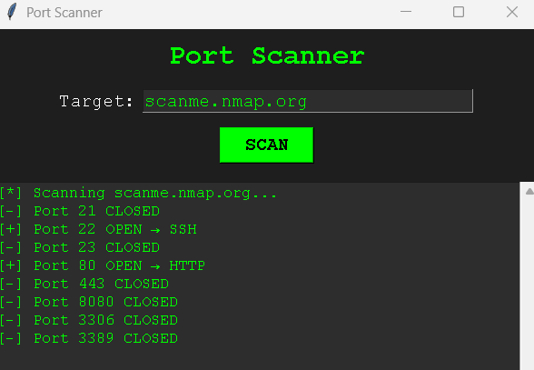

<div align="center">

# 🔍 Security Tools

**A collection of offensive security tools for bug bounty and penetration testing.**


</div>

---

## 📌 Overview

**Security Tools** is an open-source toolkit designed for **bug bounty hunters** and **penetration testers**. It provides fast, reliable, and easy-to-use tools to assist in the reconnaissance and vulnerability assessment phases of security engagements.

> ⚠️ **Disclaimer:** This toolkit is intended for **educational purposes** and **authorized security testing only**. Do not use these tools against systems you do not have explicit permission to test. The author is not responsible for any misuse.

---

## 🛠️ Tools

### 🔌 Port Scanner

A fast Python-based port scanner built for efficiency and clarity.

**Features:**
- ✅ Scan multiple ports simultaneously
- ✅ Domain name resolution
- ✅ Service detection (HTTP, SSH, FTP, MySQL, RDP, and more)
- ✅ Clean CLI output with open/closed status
- ✅ Graphical User Interface (GUI)

---

## 📸 Screenshots

<div align="center">



*Port Scanner GUI — scanning `scanme.nmap.org`*

</div>

---

## ⚙️ Installation

```bash
# Clone the repository
git clone https://github.com/aK50EYT/security-tools.git

# Navigate to the project directory
cd security-tools

# Install dependencies
pip install -r requirements.txt
```

---

## 🚀 Usage

### CLI Mode

```bash
cd port-scanner
python scanner.py
```

### GUI Mode

```bash
cd port-scanner
python gui.py
```

---

## 📋 Requirements

| Requirement | Version  |
|-------------|----------|
| Python      | 3.8+     |
| tkinter     | built-in |
| socket      | built-in |

---

## 📁 Project Structure

```
security-tools/
│
├── port-scanner/
│   ├── scanner.py        # CLI port scanner
│   ├── gui.py            # GUI interface
│   └── requirements.txt
│
└── README.md
```

---

## 🗺️ Roadmap

- [x] Basic port scanning
- [x] Service detection
- [x] GUI interface
- [ ] Export results to JSON/CSV
- [ ] Multi-threaded scanning
- [ ] OS fingerprinting
- [ ] Banner grabbing

---

## 🤝 Contributing

Contributions are welcome! Feel free to open an issue or submit a pull request.

1. Fork the project
2. Create your feature branch (`git checkout -b feature/AmazingFeature`)
3. Commit your changes (`git commit -m 'Add AmazingFeature'`)
4. Push to the branch (`git push origin feature/AmazingFeature`)
5. Open a Pull Request

---

## 📄 License

This project is licensed under the **MIT License** — see the [LICENSE](LICENSE) file for details.

---

<div align="center">

Made with ❤️ for the security community

</div>
